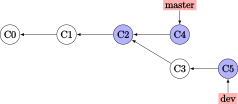

# Git 学习笔记

本文介绍了学习 Git 的路线，参考文献可从官网此处下载：[ProGit](https://git-scm.com/book/zh/v2)．

## 目录

1. [Git 学习笔记](#Git-学习笔记)
    1. [目录](#目录)
    2. [Git 简介](#Git-简介)
        1. [版本控制](#版本控制)
        2. [Git 简史](#Git-简史)
        3. [Git 仓库、工作目录与暂存区](#Git-仓库、工作目录与暂存区)
    3. [Git 准备工作](#Git-准备工作)
        1. [初次配置](#初次配置)
        2. [帮助](#帮助)
    4. [Git 基础命令](#Git-基础命令)
        1. [仓库操作](#仓库操作)
            1. [初始化仓库 (init)](#初始化仓库-init)
            2. [克隆现有仓库 (clone)](#克隆现有仓库-clone)
        2. [提交文件](#提交文件)
            1. [检查文件状态 (status)](#检查文件状态-status)
            2. [暂存文件 (add)](#暂存文件-add)
            3. [忽略文件 (.gitignore)](#忽略文件-gitignore)
            4. [内容比对 (diff)](#内容比对-diff)
            5. [提交更新 (commit)](#提交更新-commit)
        3. [变更与回退](#变更与回退)
            1. [从工作目录回退 (checkout)](#从工作目录回退-checkout)
            2. [从暂存区回退 (reset HEAD)](#从暂存区回退-reset-HEAD)
            3. [重新提交 (commit --amend)](#重新提交-commit---amend)
            4. [回退到指定的版本 (revert)](#回退到指定的版本-revert)
        4. [查看提交历史 (log)](#查看提交历史-log)
        5. [文件操作](#文件操作)
            1. [删除文件 (rm)](#删除文件-rm)
            2. [放弃追踪文件 (rm --cached)](#放弃追踪文件-rm---cached)
            3. [移动或重命名文件 (mv)](#移动或重命名文件-mv)
        6. [远程仓库操作](#远程仓库操作)
            1. [设置远程仓库 (remote)](#设置远程仓库-remote)
            2. [抓取 (fetch) 与拉取 (pull)](#抓取-fetch-与拉取-pull)
            3. [推送到远程仓库 (push)](#推送到远程仓库-push)
            4. [管理远程仓库](#管理远程仓库)
        7. [标签 (tag)](#标签-tag)
            1. [添加标签](#添加标签)
            2. [追加标签](#追加标签)
            3. [查看标签](#查看标签)
            4. [推送标签](#推送标签)
            5. [回退到标签](#回退到标签)
        8. [别名 (alias)](#别名-alias)
    5. [分支 (branch)](#分支-branch)
        1. [创建分支 (branch)](#创建分支-branch)
        2. [切换分支 (checkout)](#切换分支-checkout)
        3. [合并分支 (merge)](#合并分支-merge)

## Git 简介

### 版本控制

版本控制（Version Control System, VCS）记录了文件的变化，便于查阅或恢复到某个时刻的文件状态．

版本控制系统主要有三种：
- **本地版本控制（Local Version Control System）**：  
所有修订版本的信息都存储在本地．磁盘损坏可能损坏记录．
- **中心式版本控制（Centralized Version Control System, CVCS）**：  
所有修订版本的信息都存储在中心服务器上，协同工作的用户们通过客户端连接服务器，以此取出文件或提交更新．优点是便于管理员管理，缺点是中心服务器宕机会导致无法进行任何工作．
- **分布式版本控制（Distributed Version Control System, DVCS）**：  
客户端取出文件时，会克隆整个仓库．任一协同服务器的故障都可以从克隆仓库中恢复．

Git 属于分布式版本控制系统．

### Git 简史

2005 年，分布式版本控制系统 BitKeeper 所在公司与 Linux 内核开源社区合作结束；后者无法继续使用 BitKeeper 进行版本控制．因此 Linux 开源社区开发了自己的版本系统，称为 Git．Git 仍遵循着其设计初衷：
- 速度
- 简洁的设计
- 支持数量众多的并行开发分支
- 完全分布式
- 能够高效管理具有 Linux 或更大规模的大型项目

基本的 Git 工作特点：
- Git 记录每个版本的快照，而不是相对上个版本的变更．这使得 Git 与其他大部分版本控制系统都不相同．
- Git 使用 SHA-1 散列建立内部的索引，显示为 40 位 16 进制字符．
- Git 很少执行删除指令，因此信息误丢失的可能极小．

### Git 仓库、工作目录与暂存区

Git 仓库是保存对象数据库的地方．工作目录是从仓库中提取的某版本的文件内容，可能包含你的修改．暂存区保存了你下次要提交到仓库的内容．

在 Git 中托管的文件有三种状态：
- **已提交（commited）**：文件更改已记录到仓库中．
- **已修改（modified）**：文件被修改了（与最后一次提交的文件不同），但修改尚未记录．
- **已暂存（staged）**：文件已被修改且被标记，将在下一次提交中记录到仓库．

## Git 准备工作

### 初次配置

设置用户名和地址：
```sh
$ git config --global user.name "wklchris"
$ git config --global user.email wklchris@example.com
```

选项 `--global` 表示这些设定会应用于每个项目的 Git 仓库．

通过 `git config --list` 来罗列所有的配置参数，或 `git config <key>` 来查看某项配置的值：
```sh
$ git config user.name
wklchris
```

还有可能用到的是更改默认的编辑器（默认是 Vim）：
```sh
$ git config --global core.editor <editor>
```

### 帮助

使用 `git help <command>` 来显示帮助内容．这些帮助可以离线访问．

## Git 基础命令

### 仓库操作
#### 初始化仓库 (init)

进入你的项目目录，输入以下命令来初始化：
```sh
$ git init
```

初始化时，你的项目目录可以为空，也可以包含文件．如果你使用远程仓库工作，往往需要添加对应的地址：
```sh
$ git remote add <remote-name> <url>
```
具体请参考下文 `remote` 命令对应部分的内容．

#### 克隆现有仓库 (clone)

从指定的仓库网址（可能是 https, git, 或者 SSH 协议）取回整个仓库，便于在本地展开工作：
```sh
$ git clone <repo-url> [<folder-name>]
```
默认会在当前目录新建一个与仓库同名的文件夹，并将仓库内容放入；`<folder-name>` 参数是可省略的，如果指定将以该值作为仓库文件夹的名称．

### 提交文件
#### 检查文件状态 (status)
在初始化仓库后，立刻使用 `git status` 命令会返回以下结果：
```sh
$ git status
On branch master
nothing to commit, working directory clean
```
这表示自从上次提交以来，Git 追踪的文件都没有发生变化;同时，也没有任何新的文件被检测到．

如果新建一个 `README` 文档，再运行此命令：
```sh
$ git status
On branch master
Untracked files:
  (use "git add <file>..." to include in what will be committed)
    README
nothing added to commit but untracked files present (use "git add" to track)
```
这告诉我们发现了一个新的文件（untracked file）,它还从没被 git 版本仓库记录过．该命令还可以使用 `-s` 参数，生成一个简略列表：
```sh
$ git status -s
 M README
MM Rakefile
A  lib/git.rb
M  lib/simplegit.rb
?? LICENSE.txt
```
上例中，偏右的 `M` 表示修改了尚未暂存，偏左的 `M` 表示修改并已暂存．`A` 表示一个新加入追踪的文件，最后 `??` 表示新检测到的未追踪的文件．

#### 暂存文件 (add)
```sh
$ git add README
$ git status
On branch master
Changes to be committed:
  (use "git reset HEAD <file>..." to unstage)

    new file: README
    modified: test.py
```

你也可以通过 `git add .` 来暂存所有文件：
```sh
$ git add .
```

通常版本控制只针对文本文件；例如 `.pdf` 或 `.jpg` 这类文件一般不加入暂存．

#### 忽略文件 (.gitignore)

当目录中有许多文件或者子目录无须交付 Git 进行版本控制时，新建一个 `.gitignore` 文件:
```sh
$ touch .gitignore
```

向其中添加内容来忽略匹配的文件：
- `.gitignore` 文件特性：
    - 空行或以 '#' 开头的行会被忽略
    - 使用 glob 模式进行匹配
    - 以 `/` 开头防止匹配时递归
    - 以 `/` 结尾确保匹配目录
    - 以 `!` 开头表示取反
- **glob 模式特性**<a id="glob"></a>：glob 模式是 shell 使用的简化后的正则表达式．
    - 用 `*` 表示匹配字符 0 到无穷次
    - 用 `?` 表示匹配单个任意字符
    - 用 `[...]` 匹配任意一个方括号内的字符(例如 `[acd]` 可以是 `a`, `c` 或 `d`)，用 `[x-y]` 匹配任意一个字符 `x` 与 `y` 之间的字符（例如 `[0-9]` 匹配任意一个阿拉伯数字）
    - 用 `**` 匹配任意中间目录，例如 `a/**/b` 可以匹配 `a/c/b` 与 `a/c/d/b`．

一个简单的例子：
```sh
*.a         # 忽略所有扩展名为 .a 的文件
/A          # 忽略当前目录下名为 A 的文件
A/          # 忽略文件夹 A 内的所有内容
B/*.pdf     # 忽略文件夹 B 下的（不包括子文件夹） pdf 文件
B/**/*.pdf  # 忽略文件夹 B 及其子文件夹中的 pdf 文件
```

这里有一个 [Github 仓库](https://github.com/github/gitignore)，收录了许多编程语言的 `.gitignore` 文件样式，可以参考．

#### 内容比对 (diff)

如果你有修改了但尚未暂存的文件，使用 `git diff` 来查看**尚未暂存的改动**：
```sh
$ git diff [<filename>]
```
如果不指定文件名，那么会查看两次版本快照的差异．

如果加入 `--staged` 选项，则可以查看暂存区与版本库中最新版本之间的差异：
```sh
$ git diff --staged [<filename>]
```

#### 提交更新 (commit)

使用 `commit` 命令来提交**暂存区的所有内容**：
```sh
$ git commit
```

这时，需要你使用编辑器（默认是 Vim）来输入提交的说明文本．对于不熟悉 Vim 操作的用户，在输入内容后按 Esc 切换到 Normal 模式，再输入 `:wq` 命令即可保存并退出．

你也可以使用 `-m` 选项来避免打开编辑器：
```sh
$ git commit -m "Input text here."
```

提交后，控制台终端会显示该次提交的 SHA-1 校验、提交到的分支（关于分支的内容会在下文介绍）、修改的文件数量，以及修改的行数量．

最后，git 还提供了一种将工作区内所有文件直接暂存然后提交的选项 `-a`：
```sh
$ git commit -a -m "Input text here."
```

### 变更与回退
#### 从工作目录回退 (checkout)
你对工作目录的内容做了修改，但尚未 `add` 到暂存区．现在你想放弃这些修改，回到上次 `commit` 之后的状态:
```sh
$ git checkout -- <filename>
```
注意：**这是个危险的命令；由于被放弃的内容从未被提交，因此无法再找回**．

#### 从暂存区回退 (reset HEAD)
你的修改已经 `add` 到暂存区，现在你想把暂存区清空，但在本地文件中仍保留这些更改：
```sh
$ git reset HEAD <filename>
```

#### 重新提交 (commit --amend)
如果在提交时忘记了 `add` 某个文件，或者其他需要修改提交的场合，使用 `--amend` 参数．例如：
```sh
$ git commit -m 'initial commit'
$ git add forgotten_file
$ git commit --amend
```

它会将暂存区内的修改追加到上个提交中去．如果没有任何修改，它允许你更改提交的说明文本．

#### 回退到指定的版本 (revert)


### 查看提交历史 (log)
命令是 `log`，不过有很多有趣的参数细节：
```sh
$ git log
```

这里将参数分为输出参数与过滤参数两种．输出参数主要有：
- `-p`：查看提交内容的差异．
- `--abbrev-commit`：只显示简洁 SHA-1，一般是其前 7 个字符．
- `--color`：启用颜色．常用的颜色包括：red, green, yellow, blue, magenta, cyan, white, normal; 以及可在以上颜色之前加上格式 bold, dim, ul, blink, reverse. 例如：`%C(bold blue)`．
- `--graph`：用图像的方式显示你的分支历史．
- `--stat`：列出提交修改的文件以及一些基本修改的信息．
- `--shortstat`：只列出修改的文件数量和修改的行数．
- `--relative-date`：显示相对日期，即 "2 days ago" 这种格式．
- `--pretty=<option>`：可选的 `option` 有 `short`, `full`, `oneline` 等．

特别地，`--pretty=format:"<format-str>"` 可以自定义显示内容，例如：
```sh
$ git log --color --pretty=format:"%Cred%h%Creset %d - %s (%cr by %an)"
36e8d6b  - Update README. (2 days ago by wklchris)
bae6fc8  (origin/master, origin/dev, master) - Init (3 days ago by wklchris)
```
上例的第一列会显示为红色．我的 `lg` 命令自定义参考“别名”一节的内容．

常用的选项有：

| 选项    | 说明                                             |
| ------- | ------------------------------------------------ |
| %s      | 提交的说明文本                                   |
| %H/%h   | 提交记录的完整/简洁 SHA-1 字符串                 |
| %T/%t   | 树对象的完整/简洁 SHA-1 字符串                   |
| %P/%p   | 父对象的完整/简洁 SHA-1 字符串                   |
| %an/%cn | 作者/提交者的名字                                |
| %ae/%ce | 作者/提交者的电子邮件地址                        |
| %ad/%cd | 作者/提交者的修改日期（可用 `--date=` 指定格式） |
| %ar/%cr | 作者/提交者的修改日期，以相对日期方式显示        |


过滤参数主要有：
- `-[num]`：显示最近 num 次的提交，比如 `-2` 表示最近 2 次的提交． 
- `--author`：搜索某作者的提交．
- `--commiter`：搜索某提交者的提交．
- `--grep`：搜索提交说明文本中包含对应内容的提交．
- `--since/--after`：显示自从某日期以来的提交，可以是 `--since="2000-01-01“` 或者 `--since="1 year ago"` 形式．
- `--until/--before`：显示某日期之前的提交．

注意：**过滤参数中的“搜索”使用时，默认会以逻辑“或”连接，除非添加 `--all-match` 选项．**


### 文件操作
#### 删除文件 (rm)
手动删除文件不是常规的 git 管理操作，应该使用 `rm` 指令：
```sh
$ git rm <filename>
```
其中，`<filename>` 可以是文件（夹）名，或者是它们的通配 glob 表达式，例如：
```sh
git rm data/\*.log
```
其他选项：
- 选项 `--dry-run` 会显示你将删除的文件（但不执行删除操作），这往往用于检查你的 glob 表达式是否书写正确．
- 选项 `-f` 用来删除已经暂存的文件．这是防止未快照的文件被误删．

#### 放弃追踪文件 (rm --cached)
放弃追踪（untrack）文件：即让 git 放弃记录某一文件的修改状态，但仍保留该文件在磁盘．这一情形通常是你在添加 `.gitignore` 前就进行了 `add` 的误操作.这是你需要 `--cached` 选项：
```sh
$ git rm --cached <filename>
```

#### 移动或重命名文件 (mv)
相当于先 `rm` 再 `add`，但是 `mv` 命令更简洁：
```sh
$ git mv <filename_from> <filename_to>
```

### 远程仓库操作
#### 设置远程仓库 (remote)
不只是 Github，所有远程仓库都是类似的．首先你需要指定的远程仓库：
```sh
$ git remote add <remote-name> <url>
```

使用 `remote -v` 来查看远程仓库列表：
```sh
$ git remote -v
origin  https://github.com/wklchris/CS-Learning.git (fetch)
origin  https://github.com/wklchris/CS-Learning.git (push)
```
其中 fetch 表示从哪个远程仓库抓取， push 表示推送到哪个远程仓库．一般地，你的远程仓库名称叫做 origin．

#### 抓取 (fetch) 与拉取 (pull)
使用 `fetch` 命令来抓取远程仓库的内容：
```sh
$ git fetch <remote-name>
```
但这个命令需要你手动进行文件合并操作．如果存在一个分支跟踪远程分支（详见下文分支部分的内容），那么一般使用 `pull` 指令拉取内容；该指令会自动尝试合并文件：
```sh
$ git pull <remote-name>
```
通常，如果你从某一远程仓库将其 `clone` 到本地，会自动设置跟踪其远程仓库的默认分支（通常叫 master）．之后你的 `pull` 命令会自动从该地址取得数据并尝试合并．

#### 推送到远程仓库 (push)
当你的仓库内容处于上游、且你拥有写入权限时，使用 `push` 命令即可推送：
```sh
$ git push origin master
```
该命令的含义是将本地的 master 分支推送到名为 origin 的远程仓库．

上游的含义是在你克隆仓库到推送修改这一时段内，没有新的推送到达远程仓库．例如，如果你和另一个人同时克隆了仓库，但他先于你推送，那么你必须拉取他的内容合并后才能推送你的修改．

#### 管理远程仓库
查看远程仓库，以及进行 `pull/push` 时默认的操作，使用：
```sh
$ git remote show <remote-name>
```

重命名远程仓库:
```sh
$ git remote rename <old-name> <new-name>
```

从列表中移除某远程仓库：
```sh
$ git remote rm <remote-name>
```

### 标签 (tag)
#### 添加标签
有时我们需要标签来标记节点，比如重要版本是在哪个 commit 发布的：
```sh
$ git tag v1.0
```
这个语句没有使用任何参数，称为**轻量标签（Lightweighted tag）**．它会将 "v1.0" 标签加到最后一次 commit 上．

如果你想同时附上一些说明文字，使用**附注标签（Annotated tag）**，即用 `-a` 选项：
```sh
$ git tag -a v1.0 -m "This is a new version."
```

#### 追加标签
如果要添加标签到以往的 commit 位置，可以指定对应 commit 的哈希值（或其前 7 位），例如:
```sh
$ git tag -a v1.0 36e8d6b
```

#### 查看标签
查看所有的标签，或用上文介绍的 <a href="#glob">glob 模式</a>查询：
```sh
$ git tag
$ git tag --list "v1.0*"
```

要查看某一条标签:
```sh
$ git show v1.0
```

#### 推送标签
通常 `git push` 命令不会将标签推送到远程仓库，你需要手动推送：
```sh
$ git push origin v1.0
```

如果你想将全部标签推送，使用 `--tags` 选项：
```sh
$ git push origin --tags
```

#### 回退到标签
当你想回退到一个带有标签的 commit 的状态，你可以直接使用标签指令而不需找出它的 SHA-1 值．通常的做法是在标签上创建一个新分支：
```sh
git checkout -b <branch_name> <tag_name>
```
其中 `checkout -b` 实质是新建分支的命令，我们在下文讨论．

### 别名 (alias)
关于别名的使用我们在前文已经有所提及，这里有一些常用的例子：
```sh
$ git config --global alias.st status
$ git config --global alias.unstage 'reset HEAD --'
$ git config --gloabl alias.last 'log -1 HEAD'
```

我在日常使用中还将日志命令设置了别名：
```sh
$ git config --global alias.lg "log --color --graph --pretty=format:'%Cred%h%Creset:%C(ul yellow)%d%Creset %s (%Cgreen%cr%Creset, %C(bold blue)%an%Creset)' --abbrev-commit"
```
这样使用 `git lg` 的显示效果比原生的 `git log` 显示舒服得多．


## 分支 (branch)
总是在一个分支上工作不是正确的 git 使用方式．通常，我们在研发分支工作，频繁地进行推送；每当累计更新到一个较稳定的版本，我们才会向 master 分支合并．还记得每个 commit 都是快照吗？事实上，每个 commit 也有一个指向本分支前一次 commit 的指针,而 git 通过一个名为 “HEAD” 的指针，来标记当前处于哪个分支．

分支的特性有多重要呢？我认为，**不了解分支，不足以谈用过 git．**这也是将分支单独作为一章的原因．

需要指出：“master” 并不是一个特殊的分支；只不过 `git init` 命令会自动创建一个名为 master 的分支作为初始分支，而大多数用户都懒得去改动它．

### 创建分支 (branch)
创建一个名为 dev 的分支（我通常将开发分支叫这个名字）：
```sh
$ git branch dev
```

git 通过 HEAD 指针管理“当前分支”．例如：
```sh
$ git log --oneline
b895843 (HEAD -> dev, origin/dev) GitLearning: Update to 'tag' section.
def0a06 Git: Init.
36e8d6b Update README.
bae6fc8 (origin/master, master) Init
```
以上输出结果说明 HEAD 指向 dev 分支，而 master 分支停留在之前的位置．

### 切换分支 (checkout)
切换到一个已有的分支：
```sh
$ git checkout dev
```

要新建一个分支并切换过去，添加 `-b` 选项：
```sh
$ git checkout -b test
```

### 合并分支 (merge)
我们通过一个例子来了解分支合并．这个例子来自与官方手册，有改动．

假设你拥有一个仓库，master 分支有 3 个提交，而你正在 dev 分支上工作：
<p align="center">
  
</p>

注意到你的 dev 分支此时是领先于 master 分支的．这时，你接到一个 issue 17，说你的 master 分支有一个问题需要立刻修复，因此你不得不切换分支去解决它．你的做法是回到 master 分支，新建一个 hotfix 分支（假设你的 dev 工作目录的改动都已经提交；我们稍晚再来讨论存在文件未提交的情况）：
```sh
$ git checkout master
$ git checkout -b hotfix
...
$ git commit -a -m "Fix issue #17."
```

此时分叉（diverge）就出现了，你的 hotfix 分支修复后，指针位于 C4:
<p align="center">
  
</p>

既然 hotfix 分支完成了它的使命，那么就需要将它的内容 `merge` 到 master 分支，并在成功合并后删除它：
```sh
$ git checkout master
$ git merge hotfix
$ git branch -d hotfix
```
该合并是一个典型的 fast-forward 合并，即发生合并操作的两个分支之间没有分叉（即 master 没有在 C2 之后的提交；此时合并操作只需要确认无冲突后，移动 master 指针到 hotfix 指针所在位置即可）．

好了，现在你完成了 issue 17 的热更新，继续回到你的 dev 分支工作．不多久，你完成了你在 dev 分支的工作，也就是提交 C5：
```sh
$ git checkout dev
...
$ git commit -a -m "New feature & bug: ..."
```

注意到 master 位于 C4 而不再是 C2，这是因为与已被删除的 hotfix 分支合并过：
<p align="center">
  
</p>

现在需要开始一次新的合并了，切换到 master 分支以进行合并：
```sh
$ git checkout master
$ git merge dev
```

这次分支合并主要涉及到三个提交点，在上图中已经标出：
- C4：master 分支当前位置；
- C5：dev 分支当前位置；
- C2：两个分支的共同祖先（common ancestor）．

此时的合并是一个三方合并（three-way merge）,无法通过简单地移动指针来完成．因此，git 会新建一个合并提交（merge commit）C6，其特点是拥有两个父提交．
<p align="center">
  
</p>

如果没有冲突，就能成功合并．合并后，你可以删除 dev 分支．
```sh
$ git branch -d dev
```
在下文会讨论如果发生了冲突，将如何处理．
