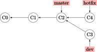
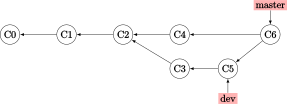

# Git 学习笔记
*本项目的 GitHub 仓库地址：[wklchris 的 CS-Learning 仓库](https://github.com/wklchris/CS-Learning)．*

本文介绍了学习 Git 的路线，参考文献是官方教程，可从官网此处下载：[ProGit](https://git-scm.com/book/zh/v2)．

## 目录

1. [Git 学习笔记](#Git-学习笔记)
    1. [目录](#目录)
    2. [Git 简介](#Git-简介)
        1. [版本控制](#版本控制)
        2. [Git 简史](#Git-简史)
        3. [Git 仓库、工作目录与暂存区](#Git-仓库、工作目录与暂存区)
    3. [Git 准备工作](#Git-准备工作)
        1. [初次配置](#初次配置)
        2. [帮助](#帮助)
    4. [Git 基础命令](#Git-基础命令)
        1. [仓库操作](#仓库操作)
            1. [初始化仓库 (init)](#初始化仓库-init)
            2. [克隆现有仓库 (clone)](#克隆现有仓库-clone)
        2. [提交文件](#提交文件)
            1. [检查文件状态 (status)](#检查文件状态-status)
            2. [暂存文件 (add)](#暂存文件-add)
            3. [忽略文件 (.gitignore)](#忽略文件-gitignore)
            4. [内容比对 (diff)](#内容比对-diff)
            5. [提交更新 (commit)](#提交更新-commit)
        3. [变更与回退](#变更与回退)
            1. [从工作目录回退 (reset --hard)](#从工作目录回退-reset---hard)
            2. [从暂存区回退 (reset --mixed)](#从暂存区回退-reset---mixed)
            3. [从版本回退 (reset --soft)](#从版本回退-reset---soft)
            4. [修改提交 (commit --amend)](#修改提交-commit---amend)
        4. [查看提交历史 (log)](#查看提交历史-log)
            1. [基本参数](#基本参数)
            2. [比较分支间的提交](#比较分支间的提交)
        5. [文件操作](#文件操作)
            1. [删除文件 (rm)](#删除文件-rm)
            2. [放弃追踪文件 (rm --cached)](#放弃追踪文件-rm---cached)
            3. [移动或重命名文件 (mv)](#移动或重命名文件-mv)
        6. [远程仓库操作](#远程仓库操作)
            1. [设置远程仓库 (remote)](#设置远程仓库-remote)
            2. [抓取 (fetch) 与拉取 (pull)](#抓取-fetch-与拉取-pull)
            3. [推送到远程仓库 (push)](#推送到远程仓库-push)
            4. [管理远程仓库 (remote)](#管理远程仓库-remote)
        7. [标签 (tag)](#标签-tag)
            1. [添加标签](#添加标签)
            2. [追加标签](#追加标签)
            3. [查看标签](#查看标签)
            4. [推送标签](#推送标签)
            5. [回退到标签](#回退到标签)
        8. [别名 (alias)](#别名-alias)
    5. [分支 (branch)](#分支-branch)
        1. [创建分支 (branch)](#创建分支-branch)
        2. [切换分支 (checkout)](#切换分支-checkout)
        3. [合并分支 (merge)](#合并分支-merge)
        4. [删除分支 (branch -d)](#删除分支-branch--d)
        5. [冲突处理](#冲突处理)
        6. [查看分支列表](#查看分支列表)
        7. [分支工作流策略](#分支工作流策略)
            1. [长期分支](#长期分支)
            2. [特性分支](#特性分支)
        8. [远程分支](#远程分支)
            1. [跟踪分支 (--track)](#跟踪分支---track)
            2. [删除远程分支 (--delete)](#删除远程分支---delete)
        9. [变基\* (rebase)](#变基-rebase)
            1. [基础变基流程](#基础变基流程)
            2. [更复杂的变基场景](#更复杂的变基场景)
            3. [变基的风险](#变基的风险)
            4. [变基改写日志](#变基改写日志)
            5. [合并与变基的争论](#合并与变基的争论)
    6. [其他 Git 命令](#其他-Git-命令)
        1. [显示 (show)](#显示-show)
        2. [引用日志 (reflog)](#引用日志-reflog)
        3. [储藏 (stash) 与清理 (clean)](#储藏-stash-与清理-clean)
            1. [恢复储藏 (stash apply)](#恢复储藏-stash-apply)
            2. [丢弃储藏 (stash drop)](#丢弃储藏-stash-drop)
            3. [清理目录](#清理目录)
        4. [GPG 签署工具](#GPG-签署工具)
            1. [签署标签](#签署标签)
            2. [签署提交](#签署提交)
            3. [签署合并与拉取](#签署合并与拉取)
            4. [查看与验证签名](#查看与验证签名)
        5. [高级冲突处理](#高级冲突处理)
            1. [中断合并](#中断合并)
            2. [忽略空白变更](#忽略空白变更)
            3. [手动合并文件](#手动合并文件)
            4. [检出冲突](#检出冲突)
            5. [查询日志](#查询日志)
            6. [冲突的差异与日志](#冲突的差异与日志)
            7. [撤销合并提交](#撤销合并提交)
            8. [偏好合并](#偏好合并)
            9. [伪合并](#伪合并)

## Git 简介

### 版本控制

版本控制（Version Control System, VCS）记录了文件的变化，便于查阅或恢复到某个时刻的文件状态．

版本控制系统主要有三种：
- **本地版本控制（Local Version Control System）**：  
所有修订版本的信息都存储在本地．磁盘损坏可能损坏记录．
- **中心式版本控制（Centralized Version Control System, CVCS）**：  
所有修订版本的信息都存储在中心服务器上，协同工作的用户们通过客户端连接服务器，以此取出文件或提交更新．优点是便于管理员管理，缺点是中心服务器宕机会导致无法进行任何工作．
- **分布式版本控制（Distributed Version Control System, DVCS）**：  
客户端取出文件时，会克隆整个仓库．任一协同服务器的故障都可以从克隆仓库中恢复．

Git 属于分布式版本控制系统．

### Git 简史

2005 年，分布式版本控制系统 BitKeeper 所在公司与 Linux 内核开源社区合作结束；后者无法继续使用 BitKeeper 进行版本控制．因此 Linux 开源社区开发了自己的版本系统，称为 Git．Git 仍遵循着其设计初衷：
- 速度
- 简洁的设计
- 支持数量众多的并行开发分支
- 完全分布式
- 能够高效管理具有 Linux 或更大规模的大型项目

基本的 Git 工作特点：
- Git 记录每个版本的快照，而不是相对上个版本的变更．这使得 Git 与其他大部分版本控制系统都不相同．
- Git 使用 SHA-1 散列建立内部的索引，显示为 40 位 16 进制字符．
- Git 很少执行删除指令，因此信息误丢失的可能极小．

### Git 仓库、工作目录与暂存区

Git 仓库是保存对象数据库的地方．工作目录是从仓库中提取的某版本的文件内容，可能包含你的修改．暂存区保存了你下次要提交到仓库的内容．

在 Git 中托管的文件有三种状态：
- **已提交（commited）**：文件更改已记录到仓库中．
- **已修改（modified）**：文件被修改了（与最后一次提交的文件不同），但修改尚未记录．
- **已暂存（staged）**：文件已被修改且被标记，将在下一次提交中记录到仓库．

git 中的 HEAD 指针指向当前位置（最后一次提交），除非人为地移动它．

## Git 准备工作

### 初次配置

设置用户名和地址：
```sh
$ git config --global user.name "wklchris"
$ git config --global user.email wklchris@example.com
```

选项 `--global` 表示这些设定会应用于每个项目的 Git 仓库．

通过 `git config --list` 来罗列所有的配置参数，或 `git config <key>` 来查看某项配置的值：
```sh
$ git config user.name
wklchris
```

还有可能用到的是更改默认的编辑器（默认是 Vim）：
```sh
$ git config --global core.editor <editor>
```

### 帮助

使用 `git help <command>` 来显示帮助内容．这些帮助可以离线访问．

## Git 基础命令

### 仓库操作
#### 初始化仓库 (init)
这部分只介绍了本地仓库的初始化；如果想了解远程仓库的操作，请参考[远程仓库操作](#远程仓库操作)部分的内容．

进入你的项目目录，输入以下命令来初始化：
```sh
$ git init
```

初始化时，你的项目目录可以为空，也可以包含文件．如果你使用远程仓库工作，往往需要添加对应的地址：
```sh
$ git remote add <remote-name> <url>
```
具体请参考下文 `remote` 命令对应部分的内容．

#### 克隆现有仓库 (clone)

从指定的仓库网址（可能是 https, git, 或者 SSH 协议）取回整个仓库，便于在本地展开工作：
```sh
$ git clone <repo-url> [<folder-name>]
```
默认会在当前目录新建一个与仓库同名的文件夹，并将仓库内容放入；`<folder-name>` 参数是可省略的，如果指定将以该值作为仓库文件夹的名称．该命令会自动将远程仓库命名为 origin（就像默认的分支名叫 master 一样），如果你不喜欢，可以用 `-o` 选项更改：
```sh
$ git clone -o <remote-repo-name> <repo-url>
```

### 提交文件
#### 检查文件状态 (status)
在初始化仓库后，立刻使用 `git status` 命令会返回以下结果：
```sh
$ git status
On branch master
nothing to commit, working directory clean
```
这表示自从上次提交以来，Git 追踪的文件都没有发生变化;同时，也没有任何新的文件被检测到．

如果新建一个 `README` 文档，再运行此命令：
```sh
$ git status
On branch master
Untracked files:
  (use "git add <file>..." to include in what will be committed)
    README
nothing added to commit but untracked files present (use "git add" to track)
```
这告诉我们发现了一个新的文件（untracked file）,它还从没被 git 版本仓库记录过．该命令还可以使用 `-s` 参数，生成一个简略列表：
```sh
$ git status -s
 M README
MM Rakefile
A  lib/git.rb
M  lib/simplegit.rb
?? LICENSE.txt
```
上例中，偏右的 `M` 表示修改了尚未暂存，偏左的 `M` 表示修改并已暂存．`A` 表示一个新加入追踪的文件，最后 `??` 表示新检测到的未追踪的文件．

#### 暂存文件 (add)
```sh
$ git add README
$ git status
On branch master
Changes to be committed:
  (use "git reset HEAD <file>..." to unstage)

    new file: README
    modified: test.py
```

你也可以通过 `git add *` 来暂存所有文件：
```sh
$ git add *
```
其他：  
- 通常版本控制只针对文本文件；例如 `.pdf` 或 `.jpg` 这类文件一般不加入暂存．
- 在暂存时使用 `-i` （或 `--interactive`）选项，可以进入交互式暂存界面．

#### 忽略文件 (.gitignore)

当目录中有许多文件或者子目录无须交付 Git 进行版本控制时，新建一个 `.gitignore` 文件:
```sh
$ touch .gitignore
```

向其中添加内容来忽略匹配的文件：
- `.gitignore` 文件特性：
    - 空行或以 '#' 开头的行会被忽略
    - 使用 glob 模式进行匹配
    - 以 `/` 开头防止匹配时递归
    - 以 `/` 结尾确保匹配目录
    - 以 `!` 开头表示取反
- **glob 模式特性**<a id="glob"></a>：glob 模式是 shell 使用的简化后的正则表达式．
    - 用 `*` 表示匹配字符 0 到无穷次
    - 用 `?` 表示匹配单个任意字符
    - 用 `[...]` 匹配任意一个方括号内的字符(例如 `[acd]` 可以是 `a`, `c` 或 `d`)，用 `[x-y]` 匹配任意一个字符 `x` 与 `y` 之间的字符（例如 `[0-9]` 匹配任意一个阿拉伯数字）
    - 用 `**` 匹配任意中间目录，例如 `a/**/b` 可以匹配 `a/c/b` 与 `a/c/d/b`．

一个简单的例子：
```sh
*.a         # 忽略所有扩展名为 .a 的文件
/A          # 忽略当前目录下名为 A 的文件
A/          # 忽略文件夹 A 内的所有内容
B/*.pdf     # 忽略文件夹 B 下的（不包括子文件夹） pdf 文件
B/**/*.pdf  # 忽略文件夹 B 及其子文件夹中的 pdf 文件
```

如果你想要将一些后缀加入全局的忽略列表，可以在 `~` 目录下新建一个 `.gitignore_global` 文件，并使用命令：
```sh
$ git config --global core.excludesfile ~/.gitignore_global
```

这里有一个 [Github 仓库](https://github.com/github/gitignore)，收录了许多编程语言的 `.gitignore` 文件样式，可以参考．

#### 内容比对 (diff)

如果你有修改了但尚未暂存的文件，使用 `git diff` 来查看**尚未暂存的改动**：
```sh
$ git diff [<filename>]
```
如果不指定文件名，那么会查看两次版本快照所有文件的差异．

如果加入 `--staged` 选项，则可以查看暂存区与版本库中最新版本之间的差异：
```sh
$ git diff --staged [<filename>]
```

#### 提交更新 (commit)

使用 `commit` 命令来提交**暂存区的所有内容**：
```sh
$ git commit
```

这时，需要你使用编辑器（默认是 Vim）来输入提交的说明文本．对于不熟悉 Vim 操作的用户，在输入内容后按 Esc 切换到 Normal 模式，再输入 `:wq` 命令即可保存并退出．

你也可以使用 `-m` 选项来避免打开编辑器：
```sh
$ git commit -m "Input text here."
```

提交后，控制台终端会显示该次提交的 SHA-1 校验、提交到的分支（关于分支的内容会在下文介绍）、修改的文件数量，以及修改的行数量．

最后，git 还提供了一种将工作区内所有文件直接暂存然后提交的选项 `-a`：
```sh
$ git commit -a -m "Input text here."
```

### 变更与回退
我们简单提到过 git 使用 HEAD 指针指向最新的一次提交．每一次提交的之前的紧邻提交称为父提交．比如次新的提交就是 `HEAD~`，父提交的父提交是 `HEAD~2`．(确切地说，`~` 指代的是第一父提交，第一父提交的第二父提交需要使用 `HEAD~2^2`．请参考[分支 (branch)](#分支-branch)部分的内容)．

#### 从工作目录回退 (reset --hard)
你对工作目录的内容做了修改，但尚未 `add` 到暂存区．现在你想放弃这些修改，回到上次 `commit` 之后的状态:
```sh
# 危险的命令！
$ git reset --hard HEAD <filename>
```
这里 `HEAD` 是缺省值，可以省略；你也可以用 SHA-1 值（或其前 7 位）来指定要回退到的版本．本质是放弃并销毁上次 `commit` 以来所有的更改．

注意：**这是个危险的命令；由于被放弃的内容从未被提交，因此无法再找回**．

#### 从暂存区回退 (reset --mixed)
你的修改已经 `add` 到暂存区，现在你想把暂存区清空，但在本地文件中仍保留这些更改：
```sh
$ git reset --mixed HEAD <filename>
```
这里的 `--mixed` 选项是缺省值，可以省略．该命令相当于取消了 `add` 命令，更改仍存在于文件中．

#### 从版本回退 (reset --soft)
你的文件已 `commit` 到仓库记录中去，现在你想将 HEAD 指针移动到上一个 commit 的位置:
```sh
$ git reset --soft HEAD~
```
`HEAD~` 表示 HEAD 指针的父节点．

此时你的暂存区、工作目录并未被回退，仍保留着你的改动．本质是撤销了最近的一次 `commit` 命令．

注意，**如果你要应用回退的版本已经推送到远程仓库，那么不要使用 `reset` 命令**．请使用 `revert` 命令来新建一个提交，这个提交的内容将与你指定的版本一致：
```sh
$ git revert HEAD~
```
`revert` 命令在还原合并提交中也有作用，可以参考[撤销合并提交](#撤销合并提交)部分的内容．

#### 修改提交 (commit --amend)
如果在提交时忘记了 `add` 某个文件，或者其他需要修改提交的场合，使用 `--amend` 参数．例如：
```sh
$ git commit -m 'initial commit'
$ git add forgotten_file
$ git commit --amend
```
它会将暂存区内的修改追加到上个提交中去．如果没有任何修改，它允许你更改提交的说明文本．


### 查看提交历史 (log)
命令是 `log`，不过有很多有趣的参数细节：
```sh
$ git log
```

#### 基本参数
这里将参数分为输出参数与过滤参数两种．输出参数主要有：
- `-p`：查看提交内容的差异．
- `--abbrev-commit`：只显示简洁 SHA-1，一般是其前 7 个字符．
- `--color`：启用颜色．常用的颜色包括：red, green, yellow, blue, magenta, cyan, black, white, normal; 以及可在以上颜色之前加上格式 bold, dim, ul, blink, reverse. 例如：`%C(bold blue)`．
- `--graph`：用图像的方式显示你的分支历史．
- `--stat`：列出提交修改的文件以及一些基本修改的信息．
- `--shortstat`：只列出修改的文件数量和修改的行数．
- `--relative-date`：显示相对日期，即 "2 days ago" 这种格式．
- `--pretty=<option>`：可选的 `option` 有 `short`, `full`, `oneline` 等．

特别地，`--pretty=format:"<format-str>"` 可以自定义显示内容，例如：
```sh
$ git log --color --pretty=format:"%Cred%h%Creset %d - %s (%cr by %an)"
36e8d6b  - Update README. (2 days ago by wklchris)
bae6fc8  (origin/master, origin/dev, master) - Init (3 days ago by wklchris)
```
上例的第一列会显示为红色．我的 `lg` 命令自定义参考“别名”一节的内容．

常用的选项有：

| 选项    | 说明                                             |
| ------- | ------------------------------------------------ |
| %s      | 提交的说明文本                                   |
| %H/%h   | 提交记录的完整/简洁 SHA-1 字符串                 |
| %T/%t   | 树对象的完整/简洁 SHA-1 字符串                   |
| %P/%p   | 父对象的完整/简洁 SHA-1 字符串                   |
| %an/%cn | 作者/提交者的名字                                |
| %ae/%ce | 作者/提交者的电子邮件地址                        |
| %ad/%cd | 作者/提交者的修改日期（可用 `--date=` 指定格式） |
| %ar/%cr | 作者/提交者的修改日期，以相对日期方式显示        |


过滤参数主要有：
- `-[num]`：显示最近 num 次的提交，比如 `-2` 表示最近 2 次的提交． 
- `--author`：搜索某作者的提交．
- `--commiter`：搜索某提交者的提交．
- `--grep`：搜索提交说明文本中包含对应内容的提交．
- `--since/--after`：显示自从某日期以来的提交，可以是 `--since="2000-01-01“` 或者 `--since="1 year ago"` 形式．
- `--until/--before`：显示某日期之前的提交．

注意：**过滤参数中的“搜索”使用时，默认会以逻辑“或”连接，除非添加 `--all-match` 选项．**

#### 比较分支间的提交
还有一种常用的操作，用于显示位于某分支但未合并到另一分支的提交．比如显示位于 dev 分支但尚未加入 master 分支的提交、以及在当前分支却不在远程仓库的提交：
```sh
# 两点命令
$ git log master..dev
$ git log origin/master..HEAD
```

如果使用三点命令，则会显示只位于两分支之一的提交．通常使用 `--left-right` 选项来让 git 显示提交位于哪个分支上：
```sh
# 三点命令
$ git log --left-right master...dev
```

用 `^` 或者 `--not` 指明你不想查看的提交．比如，查看被 A, B 包含但不被 C 包含的提交，以下两种均可：
```sh
$ git log refA refB ^refC
$ git log refA refB --not refC
```


### 文件操作
#### 删除文件 (rm)
手动删除文件不是常规的 git 管理操作，应该使用 `rm` 指令：
```sh
$ git rm <filename>
```
其中，`<filename>` 可以是文件（夹）名，或者是它们的通配 glob 表达式，例如：
```sh
git rm data/\*.log
```
其他选项：
- 选项 `--dry-run` 会显示你将删除的文件（但不执行删除操作），这往往用于检查你的 glob 表达式是否书写正确．
- 选项 `-f` 用来删除已经暂存的文件．这是防止未快照的文件被误删．

#### 放弃追踪文件 (rm --cached)
放弃追踪（untrack）文件：即让 git 放弃记录某一文件的修改状态，但仍保留该文件在磁盘．这一情形通常是你在添加 `.gitignore` 前就进行了 `add` 的误操作.这是你需要 `--cached` 选项：
```sh
$ git rm --cached <filename>
```

#### 移动或重命名文件 (mv)
相当于先 `rm` 再 `add`，但是 `mv` 命令更简洁：
```sh
$ git mv <filename_from> <filename_to>
```

### 远程仓库操作
#### 设置远程仓库 (remote)
不只是 Github，所有远程仓库都是类似的．首先你需要指定的远程仓库：
```sh
$ git remote add <remote-name> <url>
```

使用 `remote -v` 来查看远程仓库列表：
```sh
$ git remote -v
origin  https://github.com/wklchris/CS-Learning.git (fetch)
origin  https://github.com/wklchris/CS-Learning.git (push)
```
其中 fetch 表示从哪个远程仓库抓取， push 表示推送到哪个远程仓库．一般地，你的远程仓库名称叫做 origin．

#### 抓取 (fetch) 与拉取 (pull)
使用 `fetch` 命令来抓取远程仓库的内容：
```sh
$ git fetch <remote-name>
```
但这个命令需要你手动进行文件合并操作．如果存在一个分支跟踪远程分支（详见下文分支部分的内容），那么一般使用 `pull` 指令拉取内容；该指令会自动尝试合并文件：
```sh
$ git pull <remote-name>
```
通常，如果你从某一远程仓库将其 `clone` 到本地，会自动设置跟踪其远程仓库的默认分支（通常叫 master）．之后你的 `pull` 命令会自动从该地址取得数据并尝试合并．

#### 推送到远程仓库 (push)
当你的仓库内容处于上游、且你拥有写入权限时，使用 `push` 命令即可推送：
```sh
$ git push origin master
```
该命令的含义是将本地的 master 分支推送到名为 origin 的远程仓库．

上游的含义是在你克隆仓库到推送修改这一时段内，没有新的推送到达远程仓库．例如，如果你和另一个人同时克隆了仓库，但他先于你推送，那么你必须拉取他的内容合并后才能推送你的修改．

#### 管理远程仓库 (remote)
查看远程仓库，以及进行 `pull/push` 时默认的操作，使用：
```sh
$ git remote show <remote-name>
```

重命名远程仓库:
```sh
$ git remote rename <old-name> <new-name>
```

从列表中移除某远程仓库：
```sh
$ git remote rm <remote-name>
```

### 标签 (tag)
#### 添加标签
有时我们需要标签来标记节点，比如重要版本是在哪个 commit 发布的：
```sh
$ git tag v1.0
```
这个语句没有使用任何参数，称为**轻量标签（Lightweighted tag）**．它会将 "v1.0" 标签加到最后一次 commit 上．

如果你想同时附上一些说明文字，使用**附注标签（Annotated tag）**，即用 `-a` 选项：
```sh
$ git tag -a v1.0 -m "This is a new version."
```

#### 追加标签
如果要添加标签到以往的 commit 位置，可以指定对应 commit 的哈希值（或其前 7 位），例如:
```sh
$ git tag -a v1.0 36e8d6b
```

#### 查看标签
查看所有的标签，或用上文介绍的 <a href="#glob">glob 模式</a>查询：
```sh
$ git tag
$ git tag --list "v1.0*"
```

要查看某一条标签:
```sh
$ git show v1.0
```

#### 推送标签
通常 `git push` 命令不会将标签推送到远程仓库，你需要手动推送：
```sh
$ git push origin v1.0
```

如果你想将全部标签推送，使用 `--tags` 选项：
```sh
$ git push origin --tags
```

#### 回退到标签
当你想回退到一个带有标签的 commit 的状态，你可以直接使用标签指令而不需找出它的 SHA-1 值．通常的做法是在标签上创建一个新分支：
```sh
git checkout -b <branch_name> <tag_name>
```
其中 `checkout -b` 实质是新建分支的命令，我们在下文讨论．

### 别名 (alias)
关于别名的使用我们在前文已经有所提及，这里有一些常用的例子：
```sh
$ git config --global alias.st status
$ git config --global alias.unstage 'reset HEAD --'
$ git config --gloabl alias.last 'log -1 HEAD'
```

我在日常使用中还将日志命令设置了别名：
```sh
$ git config --global alias.lg "log --color --graph --pretty=format:'%Cred%h%Creset:%C(ul yellow)%d%Creset %s (%Cgreen%cr%Creset, %C(bold blue)%an%Creset)' --abbrev-commit"
```
这样使用 `git lg` 的显示效果比原生的 `git log` 显示舒服得多．


## 分支 (branch)
总是在一个分支上工作不是正确的 git 使用方式．通常，我们在研发分支工作，频繁地进行推送；每当累计更新到一个较稳定的版本，我们才会向 master 分支合并．还记得每个 commit 都是快照吗？事实上，每个 commit 也有一个指向本分支前一次 commit 的指针,而 git 通过一个名为 “HEAD” 的指针，来标记当前处于哪个分支．

分支的特性有多重要呢？我认为，**不了解分支，不足以谈用过 git．**这也是将分支单独作为一章的原因．

需要指出：“master” 并不是一个特殊的分支；只不过 `git init` 命令会自动创建一个名为 master 的分支作为初始分支，而大多数用户都懒得去改动它．

### 创建分支 (branch)
创建一个名为 dev 的分支（我通常将开发分支叫这个名字）：
```sh
$ git branch dev
```

git 通过 HEAD 指针管理“当前分支”．例如：
```sh
$ git log --oneline
b895843 (HEAD -> dev, origin/dev) GitLearning: Update to 'tag' section.
def0a06 Git: Init.
36e8d6b Update README.
bae6fc8 (origin/master, master) Init
```
以上输出结果说明 HEAD 指向 dev 分支，而 master 分支停留在之前的位置．

### 切换分支 (checkout)
切换到一个已有的分支：
```sh
$ git checkout dev
```

要新建一个分支并切换过去，添加 `-b` 选项：
```sh
$ git checkout -b test
```

更多的关于 `checkout` 命令的内容，参考本文以下章节：
- [跟踪分支 (--track)](#跟踪分支---track)
- [检出冲突](#检出冲突)

### 合并分支 (merge)
我们通过一个例子来了解分支合并．这个例子来自与官方手册，有改动．

假设你拥有一个仓库，master 分支有 3 个提交，而你正在 dev 分支上工作：
<p align="center">
  
</p>

注意到你的 dev 分支此时是领先于 master 分支的．这时，你接到一个 issue 17，说你的 master 分支有一个问题需要立刻修复，因此你不得不切换分支去解决它．你的做法是回到 master 分支，新建一个 hotfix 分支（假设你的 dev 工作目录的改动都已经提交；我们稍晚再来讨论存在文件未提交的情况）：
```sh
$ git checkout master
$ git checkout -b hotfix
...
$ git commit -a -m "Fix issue #17."
```

此时分叉（diverge）就出现了，你的 hotfix 分支修复后，指针位于 C4:
<p align="center">
  
</p>

既然 hotfix 分支完成了它的使命，那么就需要将它的内容 `merge` 到 master 分支，并在成功合并后删除它：
```sh
$ git checkout master
$ git merge hotfix
$ git branch -d hotfix
```
该合并是一个典型的 fast-forward 合并，即发生合并操作的两个分支之间没有分叉（即 master 没有在 C2 之后的提交；此时合并操作只需要确认无冲突后，移动 master 指针到 hotfix 指针所在位置即可）．

好了，现在你完成了 issue 17 的热更新，继续回到你的 dev 分支工作．不多久，你完成了你在 dev 分支的工作，也就是提交 C5：
```sh
$ git checkout dev
...
$ git commit -a -m "New feature & bug: ..."
```

注意到 master 位于 C4 而不再是 C2，这是因为与已被删除的 hotfix 分支合并过：
<p align="center">
  
</p>

现在需要开始一次新的合并了，切换到 master 分支以进行合并：
```sh
$ git checkout master
$ git merge dev
```

这次分支合并主要涉及到三个提交点，在上图中已经标出：
- C4：master 分支当前位置；
- C5：dev 分支当前位置；
- C2：两个分支的共同祖先（common ancestor）．

此时的合并是一个三方合并（three-way merge）,无法通过简单地移动指针来完成．因此，git 会新建一个合并提交（merge commit）C6，其特点是拥有两个父提．
<p align="center">
  
</p>
由于我们在 master 分支上进行合并，因此 C4 称为第一父提交，C5 称为第二父提交．

### 删除分支 (branch -d)
如果没有冲突，就能成功合并．上例合并后，你可以删除 dev 分支（要删除未合并的分支，参考[查看分支列表](#查看分支列表)一节）．
```sh
$ git branch -d dev
```
在下文会讨论如果发生了冲突，将如何处理．关于删除远程仓库中的分支，参考[删除远程分支 (--delete)](#删除远程分支---delete)部分的内容．

### 冲突处理
在合并分支时，如果存在分叉，那么可能会有冲突（conflict）．冲突是指在不同的分支中，同一个文件的同一部分（比如同一行）被以不同的方式修改了．此时如果使用 `git merge` 命令，git 会在检测到冲突后自动暂停合并，弹出合并工具界面，等待用户解决．

参考官方手册得来的一个冲突提示样例：
```sh
<<<<<<< HEAD:index.html
<div id="footer">contact : email.support@github.com</div>
=======
<div id="footer">
please contact us at support@github.com
</div>
>>>>>>> dev:index.html
```
上述信息表示，`HEAD` 指针指向的版本（目前在 master 分支上，因为之前我们在尝试进行合并操作之前切换到了 master 分支）的内容如 “=======” 上方的内容所示；而 dev 分支的同一部分内容却如其下方所示.

要解决冲突，通常的做法是选择其中一个分支保留（当然，你也可以自行输入内容）：  
1. 确定要保留哪个分支的内容；
2. 将 "=======" 另一侧的所有行删除；
3. 将 "<<<<<<<", "=======" 与 ">>>>>>>" 所在的行删除．

例如，上文如果要保留 dev 分支的内容，那么就更改为：
```sh
<div id="footer">
please contact us at support@github.com
</div>
```
然后你可以退出合并工具界面了，告诉 git 已经解决了冲突．想了解更复杂的冲突处理，参考[高级冲突处理](#高级冲突处理)部分的内容．

### 查看分支列表
使用 `git branch` 命令查看分支列表，带“*”的是当前分支（即 HEAD 所在分支）：
```sh
$ git branch
* dev
 master
```
使用 `-v` 选项来查看每个分支的最后一次提交：
```sh
$ git branch -v
* dev    e6c4681 Attempt to fix center-aligning of picture in Markdown.
  master bae6fc8 Init
```
使用 `--merged` 选项以只显示完全合并到当前分支的分支．这个列表中的分支与你的当前分支没有分叉，且落后于当前分支；无特殊情况下，它们可以被删除（比如上文的 hotfix 分支已完全合并到 master 分支，可以删除）．`--no-merged` 选项则相反．
```sh
$ git branch --merged
$ git branch --no-merged
```
注意：如果你尝试用 `-d` 选项删除分支，但这个分支位于 `--no-merged` 列表中，git 会阻止你的删除操作（因为这意味着这个分支中的工作会丢失）．不过你总能使用 `-D` 选项来强制进行删除操作．

选项 `-vv` 可以查看跟踪分支的情况，参考[跟踪分支 (--track)](#跟踪分支---track)部分的内容．

### 分支工作流策略
不同的项目可能适用不同的分支策略（branching scheme）．

#### 长期分支 
长期分支（Long-Running Branches）策略应该是最常使用的一种分支工作方式．它具有以下特点：
- 只在一个分支上保留稳定的代码，比如 master 分支．
- 拥有多个前沿分支，它们往往与稳定分支不分叉，只是领先于稳定分支（换言之，它们总能被以简单移动 HEAD 指针 (fast-forward) 方式进行合并）．
- 当前沿分支达到某个较稳定的状态，就向稳定分支合并一次．
- 开发总是在前沿分支上进行，主分支上只保留稳定版本．
- 当你在一个巨型项目中时，你可能需要多个稳定分支，以控制不同的“稳定程度”．

#### 特性分支
如同上文的 hotfix 分支和 dev 分支的例子，这样的工作往往需要三方合并，或者至少需要在一段时间后才能确定哪些分支的内容可以被丢弃．这时就可以使用特性分支（Topic Branches）策略．

好在 git 总是可以快速地创建、合并和删除分支，因此一个项目里有数十个分支也不是太令人吃惊．当然，远程仓库一般只存有少量、重要的分支，**不要将数量众多的特性分支都推送到远程仓库中**．

### 远程分支
当我们使用 GitHub 或其他远程仓库的时候，它们也会存在一些指针指向你的最新提交位置．比如你将项目的 master 与 dev 分支都推送到了远程，本地的 test 分支并没有推送，那么你在远程会拥有 origin/master 与 origin/dev 两个分支，而没有 test 对应的远程分支．

#### 跟踪分支 (--track)
跟踪分支也叫上游分支．当你从远程仓库克隆了分支，你的这个本地分支会自动设置为跟踪该远程仓库的对应分支．这是你就可以使用 `git pull` 命令方便地进行本地仓库更新（参考[抓取 (fetch) 与拉取 (pull)](#抓取-fetch-与拉取-pull)部分的内容）．

如果你的需要手动设置本地分支跟踪远程分支，使用：
```sh
$ git checkout --track origin/issuefix
```
这个操作会在本地创建一个 issuefix 分支，并设置其跟踪 origin 远程仓库中的对应分支．实质上，该命令是下面这条命令的简写：
```sh
$ git checkout -b issuefix origin/issuefix
```
更改紧跟 `-b` 选项后的 issuefix，就能将本地分支设置成另外的名称．

设置了跟踪后，用 `@{upstream}` 或 `@{u}` 来指代远程分支．例如，在你设置 issuefix 分支跟踪对应远程分之后，你可以使用 `git merge @{u}` 代替 `git merge origin/issuefix`．

通过 `branch` 命令的 `-vv` 选项来查看跟踪分支的信息：
```sh
$ git branch -vv
* dev    e6c4681 Attempt to fix center-aligning of picture in Markdown.
  master bae6fc8 [origin/master] Init
```
以上表示我的 dev 分支尚未设置跟踪远程分支．

#### 删除远程分支 (--delete)
如果你向服务器推送了特性分支或问题修复，那么结束并合并到主分支后，该分支往往就可以删除：
```sh
$ git push origin --delete issuefix
```

### 变基\* (rebase)
*本节是一个选读章节，内容的实用性可能不高．*

变基实质上是与三路合并操作相关的一个操作，不过一般来说并不常用．

#### 基础变基流程
简单地说，变基修改了版本历史，将不同分支的提交在后期用移花接木的方式加入到主分支中去，使得主分支之外的分支仿佛从未出现过．还是上文的那个例子：假设 master 分支上的提交 C4、dev 分支上的 C5、共同祖先 C2 需要处理合并问题，变基的做法是将 C3 和 C5 的内容与 C4 做比较，然后在 C4 之后新建一个新的包含 C5 中所有改动的 C5'．之前的 dev 分支就不需要再管了，整个项目在分叉点后依次是 C2, C4, C3', C5'，它们都位于 master 分支上．
<p align="center">
  
  
</p>

```sh
$ git checkout dev
$ git rebase master
``` 
上面的命令之后，dev 的指针指向 C5'，但 master 的指针仍位于 C4．因此还需要一个快进合并：
```sh
$ git checkout master
$ git merge dev
```
这样就算完成了变基操作．

#### 更复杂的变基场景
如果说 dev 分支内部还有一个 next 分支，你想将 next 分支中的改动变基到 master，但不对 dev 分支进行操作．那么使用 `--onto` 选项：
```sh
$ git rebase --onto master dev next
```

#### 变基的风险
忠告：**不要对本地仓库外存在副本的分支变基**．

想象一下你拉取了一个远程仓库，做了一些改动，准备推送时却发现你的同事进行了变基操作并先于你推送了．你没有办法，只能重新取回仓库，尝试合并．

这会发生什么呢？变基操作实质上从历史中“清除”了一些节点，但由于你的本地仓库仍存在这些节点，你的第二次合并操作就会将这些节点重新加回到 git 快照中去．就像上一节的例子，你会既有已变基的 master 分支上的 C5'，又有 dev 分支（可能已经被你同事从远程仓库删除了）里的 C3 <- C5 这部分提交；你的 merge 操作会令人困惑，因为在别人看来 C5 和 C5' 的快照实质上是一模一样的．

最后的结果就是，你同事的变基操作没有任何效果，因为你又将 dev 分支的历史给加回去了．然后你把这乱糟糟的东西推送到远程仓库，大概没有人第二天能轻易从提交历史中看懂你们两人究竟干了什么．

如果，我是说万一，你的同事真的做了这样的事情，你应该在第二次取回时使用 `--rebase` 选项：
```sh
$ git pull --rebase ...
```
但这个命令也不总是保险的；根本的解决办法是，统一团队的分叉处理方式：**要么都使用合并，要么都使用变基**．

#### 变基改写日志
通过变基命令可以改写提交日志．它可以将多个提交压缩为一个，或者将一个提交拆分为多个．这里不展开介绍方法，但记住，使用交互式的命令并遵循提示将很容易完成：
```sh
$ git rebase -i HEAD~3
```
其中 `HEAD~3` 表示修改倒数第三次及以后的提交（但实际上会定位到它的父提交）．

#### 合并与变基的争论
有的开发者认为合并能够还原真实的开发流程，因此我们应当使用合并操作．改变提交历史和撒谎没什么两样.

另一部分人则认为，没有人在意你们怎么开发的，应该让项目外的人查看你的仓库历史时能够迅速看懂（而不是挣扎在一堆分支中）．提交历史就像一本使用手册，需要不断修订．如果新版本手册总是比旧版本要好，那旧版本手册当然应该被抛弃．因此他们支持变基．

这当然是一件没有获胜方的争论．我个人是合并的支持者，但的确双方都有各自的理由．
 
## 其他 Git 命令
### 显示 (show)
前文我们介绍过用 `show` 命令显示某次提交的内容，或者显示一个标签：
```sh
$ git show ae5c314
$ git show v1.0
```
其中，SHA-1 值通常用前 7 位指定．不过为了保险起见，请在 `log` 命令中使用 `--abbrev-commit` 参数，来确定其缩写位数．

如果要查看一个分支上的最新提交，使用分支名即可：
```sh
$ git show master
```

### 引用日志 (reflog)
引用日志记录了你每次移动 HEAD 指针的操作，只在本地有效；从远程仓库克隆并不会在本地创建包含之前操作的引用日志．
```sh
$ git reflog
f435e49 (HEAD -> dev, origin/dev) HEAD@{0}: commit: Git: update to rebase.
e6c4681 HEAD@{1}: commit: Attempt to fix center-aligning of picture in Markdown.
f23058c HEAD@{2}: commit: Git: Branch merge with TikZ pics.
```

你可以使用 `@{n}` 来指定只显示在 `HEAD@{n}` **之前**的操作：
```sh
$ git reflog HEAD@{3}
```

### 储藏 (stash) 与清理 (clean)
如果你需要切换分支，但当前分支的工作还不想提交．这时候需要用 `stash` 将更改到储存到一个栈上：
```sh
$ git stash
Saved working directory and index state WIP on dev: f435e49 Git: update to rebase.
```
该命令会储存工作目录和暂存区．现在再运行 `git status`，工作目录是干净的．如果你不想把已经暂存的部分储藏起来，添加 `--keep-index` 选项．
```sh
$ git stash --keep-index
```

储藏操作默认会忽略工作目录中的未跟踪文件，除非使用 `-u` （或 `--include-untracked`） 选项：
```sh
$ git stash --include-untracked
```

查看你的储藏栈：
```sh
$ git stash list
stash@{0}: WIP on dev: f435e49 Git: update to rebase.
```

#### 恢复储藏 (stash apply)
从栈中恢复一个储藏到当前:
```sh
$ git stash apply
$ git stash apply stash@{0}
```
其中 `stash@{n}` 如果不指定，会默认恢复栈顶的储藏．

恢复储藏默认会把之前存入的内容都添加到工作目录（也就是说，如果你储藏时暂存区有添加的更改，这部分更改会被退还到工作目录），除非使用 `--index` 选项：
```sh
$ git stash apply --index
On branch dev
Changes to be committed:
  (use "git reset HEAD <file>..." to unstage)

        modified:   Git/GitLearning.md

Changes not staged for commit:
  (use "git add <file>..." to update what will be committed)
  (use "git checkout -- <file>..." to discard changes in working directory)

        modified:   Git/GitLearning.md
```

注意：如果你尝试恢复到一个储藏点入栈分支之外的分支，或者你的工作目录不是干净的，恢复可能导致问题．比如你建立了一个储藏，却继续在当前位置工作，再尝试恢复．这时，你需要一个新的分支（例如命名为 dev-stash）来帮助你恢复：
```sh
$ git stash branch dev-stash
```

#### 丢弃储藏 (stash drop)
最后，如果恢复操作 `apply` 没有问题，你就可以把该储藏点从栈中丢弃了：
```sh
$ git stash drop stash@{0}
Dropped stash@{0} (2e843b866b3be25c3a8ccb5dd2c688b258d2d337)
```
你也可以用 `git stash pop` 来达到“恢复储藏，随即将其从栈中丢弃”的效果．

#### 清理目录
清理目录一般使用 `clean` 指令，它会移除所有未被追踪的文件（不包括你的 `.gitignore` 文件中排除的那些）．**这是一个危险的命令**，一个更安全的替代命令是 `git stash --all`，这样每个被移除的文件实际会被放入栈中．

如果你确认要使用这个危险的命令，可以配合 `-d` 移除未追踪文件以及所有空的子目录．添加 `-f` 选项则意味着强制移除．
```sh
$ git clean -f -d   # 危险的命令！
``` 

安全选项 `-n` 来执行一次预演，即告诉你这个操作实际上将会移除哪些文件，但此次并不执行移除操作：
```sh
$ git clean -d -n   # 显示 git clean -d 将会移除的内容
```
选项 `-x` 允许你移除那些 `.gitignore` 通配的文件．不过无论如何，我建议你在移除操作前总是用 `-n` 选项进行检查．

### GPG 签署工具
如果你从未安装过 GPG 密钥，可以生成一个，然后查看你的密钥列表：
```sh
$ gpg --gen-key
...
$ gpg --list-keys
/c/Users/username/.gnupg/pubring.gpg
------------------------------------
pub   2048R/4EA916C0 2018-04-14
uid                  Chris Wkl <chriswkl@example.com>
sub   2048R/D7E50003 2018-04-14
```

然后你可以将你的 git 默认私钥设置为这个：
```sh
git config --global user.signingkey 4EA916C0
```

#### 签署标签
在 `tag` 命令中，用 `-s` 选项代替常规的 `-a` 选项：
```sh
$ git tag -s v1.0 -m "v1.0 with sign"
```

#### 签署提交
在 `commit` 命令中添加 `-S` 选项，即可签署到提交：
```sh
$ git add *
$ git commit -S -m "Signed commit."
```

#### 签署合并与拉取
在 git 1.8.3 之后，`merge` 与 `pull` 命令都支持使用 `--verify-signatures` 来检查并拒绝没有携带可信 GPG 签名的提交．`merge` 命令可以添加 `-S` 选项来对合并后的提交添加你的签名．

#### 查看与验证签名
在 `tag` 命令中使用 `-v` 选项，以通过 GPG 来验证签名：
```sh
$ git tag -v v1.0
```
提示 "Good signature" 表示验证通过．对含有签名的标签，使用 `git show` 命令即可显示签名．

对于提交，通过 `git log --show-signature` ，或者使用 `%G?` 格式通配，来查看并验证提交中的标签：
```sh
$ git log --show-signature -1
commit f435e496320174bba55afbb19c1bd5ffb18c935a (HEAD -> dev, origin/dev)
Author: wklchris <chriswkl@example.com>
Date:   Fri Apr 13 02:23:02 2018 -0700

    Git: update to rebase.

$ git log --pretty="format:%h %G? %aN %s"
f435e49 N wklchris Git: update to rebase.
e6c4681 N wklchris Attempt to fix center-aligning of picture in Markdown.
```
如果你的提交不含标签，将不显示额外信息；对于 `%G?` 的显示，“N” 表示验证失败，“G” 表示验证通过．

### 高级冲突处理
#### 中断合并
当一次合并操作出现问题，你可以使用 `--abort` 选项中断合并：
```sh
$ git merge --abort
```
该操作会恢复到你合并前的状态——如果你合并前的目录没有未提交、未提交的修改，它可能出现问题；此外的情形它总是可靠的．

#### 忽略空白变更
如果要合并的文件有空白的问题（比如将制表符格式化为空格）,可以使用 `-Xignore-all-space`（忽略已有空白处的空白修改） 或 `-Xignore-space-change`（忽略所有空白修改）．

#### 手动合并文件
这里需要一个特别的 `git show` 命令，可以将同一文件的不同版本保存到当前目录：
```sh
$ git show :1:hello.md > hello-ancestor.md
$ git show :2:hello.md > hello-current.md
$ git show :3:hello.md > hello-branch.md
```
其中，数字 1~3 分别表示共同祖先、当前分支、要合并的分支．然后，使用罕见的 `merge-file` 命令来合并它们：
```sh
# ... 做一些修改 ...
$ git merge-file -p \
    hello-ancestor.md hello-current.md hello-branch.md > hello.md
```

完成了合并后，可以通过以下命令查看修改的内容：
```sh
$ git diff --ours    # 合并与当前分支文件的不同
$ git diff --theirs  # 合并与要合并的分支文件的不同
$ git diff --base    # 合并怎样改动了共同祖先
```
选项 `-b` 可以忽略空白变更的修改．

最后，新创建的三个 md 文件都没有用了，我们可以用 `clean` 命令清除：
```sh
$ git clean -f
Removing hello-ancestor.md
Removing hello-current.md
Removing hello-branch.md
```

#### 检出冲突
当 `merge` 命令检查到冲突时，文件中会有类似这样的片段（摘自官方手册）：
```
def hello
<<<<<<< HEAD
puts 'hola world'
=======
puts 'hello mundo'
>>>>>>> mundo
end
```

我们在之前已经介绍过，"<" 与 "-" 之间是当前分支的内容，而 "-" 与 ">" 之间是待添加分支的内容．可有时你并不清楚应当采用哪个版本，因此你希望查看它们的共同祖先的内容．使用 `--conflict=diff3`（默认是 `=merge`） 会重新生成冲突片段，但添加共同祖先内容在中间：
```sh
$ git checkout --conflict=diff3 hello.rb
...
def hello
<<<<<<< ours
puts 'hola world'
||||||| base
puts 'hello world'
=======
puts 'hello mundo'
>>>>>>> theirs
end
```
这样你就清楚地知道，共同祖先使用的是 "hello world"，与两者都不一样．如果你偏好这种格式，可以让 git 把合并冲突的默认格式设置成 `diff3` 模式：
```sh
$ git config --global merge.conflictstyle diff 
```

`checkout` 命令也有 `--ours` 与 `--theirs` 选项，用以选择对应提交的版本而抛弃另一个提交的版本．这是一种无需合并的快速方式，尤其是对二进制文件的版本控制而言．

#### 查询日志
合并冲突有时需要借助日志来解决，尝试：
```sh
# 显示两个分支在共同祖先之后的提交
$ git log --oneline --left-right HEAD...MERGE_HEAD
# 显示两个分支中与冲突文件相关的提交
$ git log --oneline --left-right --merge
```

#### 冲突的差异与日志
冲突发生后，未冲突的文件都被自动添加到暂存区，这是运行 `diff` 命令可以查看特殊格式的差异信息：
```sh  
$ git diff
diff --cc hello.rb
index 0399cd5,59727f0..0000000
--- a/hello.rb
+++ b/hello.rb
@@@ -1,7 -1,7 +1,7 @@@

  def hello
++<<<<<<< HEAD
 +  puts 'hola world'
++=======
+   puts 'hello mundo'
++>>>>>>> mundo
  end
```
注意，第一列表示当前分支与工作目录文件的区别（这里是多了一行 "hello mundo"，因为这是 mundo 分支中与当前分支产生冲突的文本），第二列表示 mundo 分支比当前分支多了一行 “hola world”．最后，以 “++” 开头的行表示是合并操作自动添加的，应当在冲突处理完毕后删除．此外，`-cc` 选项是应用于此场景的选项，git 已经自动添加了．

解决冲突后运行 `diff`，假设结果是 “hola mundo”，会有这样的输出：
```sh
  def hello
-   puts 'hola world'
 -  puts 'hello mundo'
++  puts 'hola mundo'
  end
```
这个输出对于提交前的检查十分有用．在合并后，你也可以通过 `log` 命令加上 `-cc` 选项来获取类似的输出结果：
```sh
$ git merge mundo
$ git log --cc -p -1
```

#### 撤销合并提交
假如你错误地进行了合并，尚未进行新的更改．那么可以使用：
```sh
$ git reset --hard HEAD~
```
这是因为 HEAD 分支指向 master 上的合并提交，向前回退到父提交则是移动 HEAD 到 master 合并前的那个版本．至于并入的分支的指针，它并没有移动过．

**如果你的仓库已经推送到远程，那么上述方法是不合适的**；请记住，`reset` 命令会更改日志，在共享工作流中需要避免．这时的替代方案是 `revert` 命令：
```sh
$ git revert -m 1 HEAD
```
选项 `-m 1` 表示保留该合并提交的第一父提交（即位于 master 分支的父提交）．尚未完成的合并提交中，第一父提交是 HEAD，第二父提交是并入分支（假设叫 dev）的最新提交．上述命令会撤销从第二父提交中引入的更改，同时保留第一父提交中的所有内容．注意：本命令实质上在合并提交 `M` 后**新建**了一个提交 `M'`，但 `M` 仍然被保留在了日志中．
<p align="center">
  
</p>
这里 M' 实质与 C4 的快照相同．

这样做的问题是，如果你再尝试合并，git 不会响应你的请求：
```sh
$ git merge dev
Already up-to-date.
```
也就是 C5 并不能和 M' 合并；因为 C5 已经可以由 M' 回溯到达，git 认为没有合并可以做．更不妙的是，假如你在 dev 分支又更新了内容（提交 C6），请**不要**与 M' 直接合并，否则 C3 与 C5 这两个位于上一次合并之前的更改不会被加入这次合并（而上一次合并，也就是 M，实质上又被 M' 遮盖了），你就会在这次合并后发现 C3 与 C5 的内容并没有被加入到新的合并提交中去．

解决方法是利用 `revert` 命令，将 M' 再反转回去，“恢复” M 这个合并提交（因为 M 是包含 C3 与 C5 内容算的），之后再进行合并：
```sh
$ git revert   # revert M'
$ git merge dev
```
这样新建的 M'' 提交实质上等同于之前的合并提交 M． 
<p align="center">
  
</p>

#### 偏好合并
如果你预计合并中会出现冲突，但你只要求 master 分支的内容覆盖 dev 分支的内容，你可以使用 `-Xours` 选项：
```sh
$ git merge -Xours dev
```
正如上文提及的，“ours” 指代当前分支，“theirs” 指代待合并分支．因此你也可以类似地使用 `-Xtheirs` 选项．

这两个选项对于 `merge-file` 命令也生效．

#### 伪合并
伪合并（fake merge）是指一种欺骗 git 创建合并提交的方式．它使用 `-s` 选项，指定一个伪合并策略（通常是 `ours`）：
```sh
$ git merge -s ours dev
```
作用是将当前分支的最新提交直接复制为这个合并提交（完全不管来自 dev 的最新提交是什么）．例如，你的 bugfix 分支解决了一个 master 分支的问题．考虑到你的开发分支 dev 尚不能向 master 合并，你需要做的是：
```sh
$ git checkout master
$ git merge -s ours bugfix
$ git checkout dev
$ git merge bugfix
...
$ git branch -d bugfix
```
向 master 分支伪合并 bugfix 分支（即使已经真的合并过了）的好处是欺骗了 git；以后将 dev 分支向 master 分支合并时，就不会有来自 bugfix 分支的冲突．
 